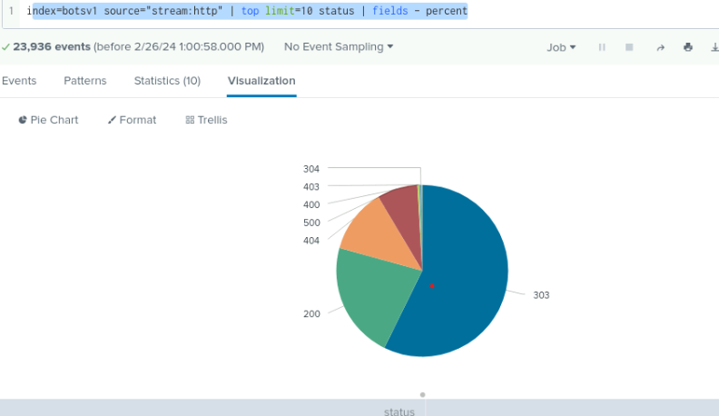

# Splunk

My first project here is focussing on Searching terms useful for Splunk.

First, I queried the data for key pieces of information using the techniques/commands - commands indicate certain actions that you want to perform on the results of a given search. This can include filtering, sorting, counting, renaming, or generating commands as well as others.

So, for example, I used the command TOP to show the most common of field values, for example the destination port (see image below) in a dataset.

I looked at the least common value by using the command RARE.

 

 

Next, I performed a search using the stats command to count the number of events present by a particular field. Notice below how it auto-suggests possible commands when you start typing.

 

 

Next, I carried out a search on a website domain name and then on the next line, using the 'top' command to determine the possible IP address of an attacker scanning this domain name for vulnerabilities.

  

 

Using this ‘attacker IP’ that was uncovered, I searched for the IP address of the web server being targeted.

  

 

Next, I started to transform the data into simple visualizations using the commands. 

 

 

